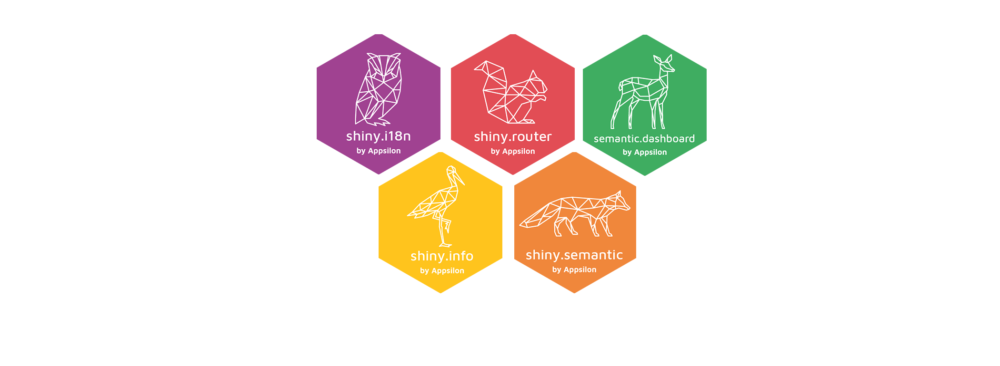

# About [Appsilon](https://appsilon.com) 
 **What mark will you leave on the world?** 

- We create, maintain, and develop Shiny applications for enterprise customers all over the world. Appsilon provides scalability, security, and modern UI/UX with custom R packages that native Shiny apps do not provide. Our team is among the world’s foremost experts in R Shiny and has made a variety of Shiny innovations over the years. Appsilon is a proud Posit (RStudio) Full Service Certified Partner.
- We are a vibrant, international team of data scientists, engineers, and innovators who are passionate about making a positive impact in the world. The belief in the power of data and technology to solve some of the world's biggest challenges drives our commitment to exploring new possibilities and solutions.

# [Appsilon](https://appsilon.com/) is hiring!

### We offer a unique environment where you can:

- Receive competitive compensation and benefits
- Enjoy a supportive and inclusive team culture
- Connect with and learn from some of the brightest minds in the field
- Work on cutting-edge projects that use data and technology to solve real-world problems

#### [Join us](https://appsilon.com/careers/) and make a difference!

# Benefits that go beyond the paycheck!
#### At Appsilon, we believe that the best benefits are the ones that help you thrive.
  
That's why we offer a comprehensive benefits package that is designed to support your career growth as well as your physical and mental well-being. 
We also give you the opportunity to grow and develop your career in a supportive and inclusive environment.  

**Here's what you can expect:**
- Competitive salary
- Generous paid time off: Benefit from 26 days of paid holidays, plus the equivalent of public holidays in Poland
- Comprehensive sick leave: Receive 33 paid sick leave days per year at 80% of your salary.
- Professional Development Budget
- Flexible remote work
- Training and conferences: Enjoy four paid days per year for training, conferences, events, or workshops.
- Health benefits: Access private health care insurance (in Poland) or a cash equivalent if you're not in Poland.
- Fitness perks: Receive a FitProfit or FitSport membership card (in Poland) or a cash equivalent if you're not in Poland.
- Life insurance: You and your family will be covered with life insurance.
- Personal assistant: Benefit from AskHenry, your assistant.

# Remote by Design

**Remote Work, global talent, supportive culture.**

- We believe that great work can be done from any location, and we're thrilled to offer a supportive and inclusive work environment for talented individuals worldwide.
- At Appsilon, we value flexibility and understand that work-life balance is essential. That’s why we've decided to work asynchronously.
- Whether you want to tailor your work to fit your family life or practice workation, we're here to support you.

Looking for a fully remote job at a company that values flexibility and collaboration? 

#### [Join us](https://appsilon.com/careers/) wherever you are!

# Why [Appsilon](https://appsilon.com/) Is the Place for You?
   

- **Company values and mission**: 
We invest in being a force good through our Data 4 Good project, actively contributing to a better world.
Attractive compensation package: We offer competitive compensation with extensive human-first, people-focused benefits to prioritize your personal and financial well-being. We provide a Personal Development Budget for you to use on your personal growth.

- **Open, kind, and understanding internal culture:** 
Our company thrives on a culture of openness and kindness, where your voice is heard and your ideas matter. We have an exceptional culture and we always check candidates alignment with our core values and Code of Conduct.

- **Great leadership:** 
Say goodbye to micromanagement. We believe in nurturing a healthy work-life balance.

- **Privately held:**
We're a fast-growing, privately held company with no outside investors, allowing us to focus on what matters most—our people and our mission.

- **High-end customers:** 
Appsilon works mostly with Global 2000 and Fortune 500 customers (startups are not our goal)

- **Market leaders:** 
Appsilon is in TOP 3 world providers of R/Shiny consulting services. We are specialists in our core technology, R/Shiny developers observe us and like to talk to us
Impact: Your work has a real impact on the work of the whole company

# Core Values

.
- ### 💯 Excellence: If you do it, do it well.
  
  We can do things that others cannot. Fortune 500 companies come to us to solve problems that they cannot solve internally. Our blog is a resource for industry professionals at Global 2K companies. We teach well-regarded workshops.

- ### 🧪 Innovation: Experiment and invent.
  
  We are not afraid to look beyond what we already know. We have multiple examples of industry breakthroughs and contributions (700+ users on a single Shiny App, shiny.react, shiny.tools). We try new things and experiment to learn more. We are 
  creative.

- ### 🙋‍♀️ Ownership: We act.
  
  We are proactive and we make important decisions. We react if there are unowned areas or risks. We start important conversations, even if they are uncomfortable.  We take pride in the work being done.

- ### ❤️ Kindness: Be kind.
  
  We genuinely care about each other and our clients. We are compassionate
  when we hire and when we need to end a partnership.

- ### 🤝 Trust: Tell the truth.
  
  We trust ourselves and each other to perform well. We are sure of the best intentions of the others in the team.

# Open Source
### Embrace [Open Source with Appsilon](https://appsilon.com/tag/open-source/)

We develop data science solutions and create innovative tools that simplify development and boost efficiency. We share these as Open Source packages because we believe in open and accessible solutions.
Our primary focus is enhancing the Shiny experience in R.

Check out our [Open Source packages](https://appsilon.com/tag/open-source/) and delve into more details. 

You're bound to find something useful!

# Recruitment Process
- If you want to know how to prepare for our recruitment process, check **[this article on our blog.](https://appsilon.com/how-to-start-a-career-as-an-r-shiny-developer/)** 
- Our recruitment process is flexible for each candidate, as we adapt it to the requirements for every open position.

**It can be summarized in these steps:**

    
